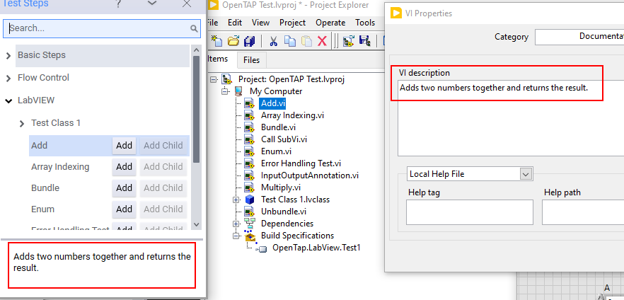

# The LabVIEW OpenTAP Plugin

This document describes how to use the LabVIEW OpenTAP plugin.

LabVIEW is a programming language and execution environment provided by National Instruments (NI) for developing test and measurement programs using a visual interface. 

A LabVIEW program consists of one or more .vi files containing LabVIEW code. Each file contains one functional unit - a VI function or a "VI", hereafter termed as a VI.

LabVIEW is a data-flow programming language where each VI has inputs and outputs. A VI can be executed in parallel or sequentially based on need. 

The LabVIEW OpenTAP plugin makes it is possible to call into a VI from OpenTAP. Such calls occur by mapping each VI to an OpenTAP test step. 

Since a VI has inputs and outputs and a VI function call takes those inputs and emits the outputs as results,
they are analogous to how OpenTAP test steps function, making conversion fairly straightforward. 
Below you can see an example of adding two numbers together in LabVIEW and how that operation appears to OpenTAP.


Many more examples like this can be found in the LabVIEW Examples Package.

## Getting Started

The first step in enabling existing LabVIEW projects to run on OpenTAP is to use the LabVIEW Application Builder plugin to convert your project into a .NET DLL.

This process is performed by adding a build specification targeting a .NET Interop Assembly, as seen below.


This selection opens a dialog for configuring a build specification. We recommend giving appropriate names to the items inside this dialog, but recommend against changing the .NET interop assembly class name. This field must contain `LabVIEWExports`.

Take note of the destination directory. For easy deployment, set the deployment directory to be your TAP installation folder or somewhere inside `[TapInstallation]/Packages/[MyProjectName]`.


Most other fields can be ignored, but it is crucial to specify the Source Files as illustrated below. Here you must export every VI of interest for calling directly from OpenTAP.


## Results and Logging

Sometimes you may want to store inputs or outputs as results or by writing them to the log.

To save the inputs and outputs as results, select the settings in the Publish Result drop-down under test step settings. 
To write the values to the log, select the Log Inputs and Outputs.


The results will be stored under a result name matching the name of the test step and column names matching the names of the selected settings.
For more information about results, see the [OpenTAP Developer Guide](https://doc.opentap.io/Developer%20Guide/Test%20Step/#publishing-results).

## Improving Usability with Annotations

Extra information can be added when building the wrapper DLL. This data can be used to provide extra information to the user via the test step.

The information itself is located inside an XML file with a name that corresponds to the name of the compiled DLL.
If you want to enable this feature, the XML file must be located with the DLL inside the OpenTAP folder.

The types of information that can be included are:

- Display Name - A user-friendly name that can be any string - including using the OpenTAP name formatting.
- Description - Adds a description to a test step or setting (tooltip).
- Unit - For numbers only. Adds a unit to a number.

Refer to the image below for a practical example showcasing these annotations.


To add this information, use the Define Prototype dialog inside the LabVIEW project build specifications as seen below:


In the Define Prototype dialog, the normal VI documentation can be used as is. It will be used as the test step description. A practical example can be seen below:



To provide a higher degree of documentation, it can be written in YAML format inside the Custom Documentation in the Define Prototype dialog.

In the InputOutputAnnotation VI, the following YAML text defines the documentation:
```yaml
Display: Input Output Annotations #The test step name you want to show the user.
Description: This test step demonstrates how annotations can work to improve usability of a test step.
Group: LabVIEW \ Annotations  # Place the test step in a sub group called Annotations inside a group called LabVIEW.
Input1:
   Display: Input 1 # The setting name you want the show the user.
   Description: This setting demonstrates how the "display name" and unit can be set.  # This turns into a tooltip on the setting. 
   Unit: s  # The unit of the value.
   Group: Inputs # Place the setting inside a group called Inputs.
Output1:
  Display: Output 1
  Description: This setting just takes the value of Input 1 and outputs it from the VI.
  Unit: s
  Group: Outputs # Place the setting inside a group called Outputs.

```

Each input or output that should be described is referenced by the name of the exported setting. 
In the example `Input1` is first referenced and then described  

The information given here is encoded into an XML file alongside the DLL file created by Application Builder.


## Sharing Plugins
LabVIEW-based plugins can be shared and deployed just as regular OpenTAP plugins can.
To enable sharing, first create a package.xml file. This type of file is described in detail in the [OpenTAP Developer Guide](https://doc.opentap.io/Developer%20Guide/Plugin%20Packaging%20and%20Versioning/#plugin-packaging-and-versioning).

Below is an example of such a file:
```xml
<Package Name="My LabView Plugin"
         xmlns="http://opentap.io/schemas/package"
         InfoLink="https://doc.opentap.io/"
         Version="0.1.0-alpha"
         Tags="LabVIEW">
  <Description>My LabVIEW plugin containing my LabVIEW code..</Description>
  <Files>
    <File Path="Packages/My LabVIEW Plugin/MyLabViewPlugin.dll">
        <IgnoreDependency>NationalInstruments.LabVIEW.Interop</IgnoreDependency>
    </File>
   <File Path="Packages/My LabVIEW Plugin/MyLabViewPlugin.xml">
   </File>
  </Files>
</Package>
```

You can then build the plugin package from the command line, as follows:
```shell
tap package create ./package.xml
``` 
This command will generate a file called `My LabVIEW Plugin.TapPackage`. This package file can be installed on other OpenTAP installations and as long as the prerequisites are installed and working comparably to the install on your computer.


## Supported VI Types

Not every type that can be used as an input or output in LabVIEW works well when exported to a .NET DLL.
Hence only a subset of LabVIEW types of inputs can be exported effectively.

The below list describes the currently working exported types:

| Type Name                | Supported | Notes                                                                                                        |
|--------------------------|-----------------------------------|--------------------------------------------------------------------------------------------------------------|
| Number                   |           | Treated as a double.                                                                                         |
| String                   |           | Text box interactivity.                                                                                      |
| VI defined Class objects |           | Can be shared between steps from the same DLL, but not across DLLs.                                          | 
| Clusters                 |           | Can be shared between steps from the same DLL                                                                |
| Error Clusters           |           | See below.                                                                                                   |
| Boolean                  |           | Booleans are displayed as checkboxes.                                                                        |
| Enum                     |           | Exported as a .NET enum. Interaction works like a drop-down.                                                 |
| Ring                     |     | Rings are exported as unsigned 16-bit values. Rings can be used but do not offer a user-friendly interface.  |
| Set                      |     | Cannot be translated to .NET.                                                                                |
| Map                      |     | Cannot be translated to .NET.                                                                                |
| Waveform                 |     | Not currently supported.                                                                                     |
| Digital Data             |     | Not currently supported.                                                                                     |
| Real Matrix              |     | Translated to `double[,]`. Support to be defined                                                             |
| ComboBox                 |     | Translated to string. Dropdown functionality not available.                                                  |
| Complex Numbers          |     | Not currently supported.                                                                                     |


### Error Clusters
Error clusters handle errors inside LabVIEW. Many vis have no side effects and hence produce no errors, but some might.

An error in a VI is represented by an error code and a message. When an VI-based test step has an error, it is handled by throwing an exception which will cause the test step to fail with an Error verdict.

See the Error Handling example for a practical example.

## Debugging

Debugging VI code is supported, both remotely or locally. Debugging must be enabled inside the build settings.

Right-click your build specification and select Advanced. Then click enable debugging as shown below. 


Optionally select "Wait for Debugger to Launch". This will have the effect that when you execute the first VI, it will wait for the debugger to become attached.

After enabling debugging, the DLL must be built again. Once it has been built with debugging enabled, the ini file accompanying the DLL must be copied to the same folder as the DLL.
The ini file can also be used to enabled and disable debugging at a later point:
```ini 
;; OpenTap.LabView.Test1.ini
[OpenTap.LabView.Test1]
   ; ...
DebugServerEnabled=True
DebugServerWaitOnLaunch=False
```

If you want to enable debugging, the INI files must be located with the DLL inside the OpenTAP folder.

To attach a debugger, start OpenTAP and use the Operate menu to attach to it as shown below.


Once this is done, it will open all vis associated with your LabVIEW project. 
Note that the files opened are the ones located inside the compiled DLL and not the ones inside your project.

Refer to LabVIEW documentation for more information about debugging.
